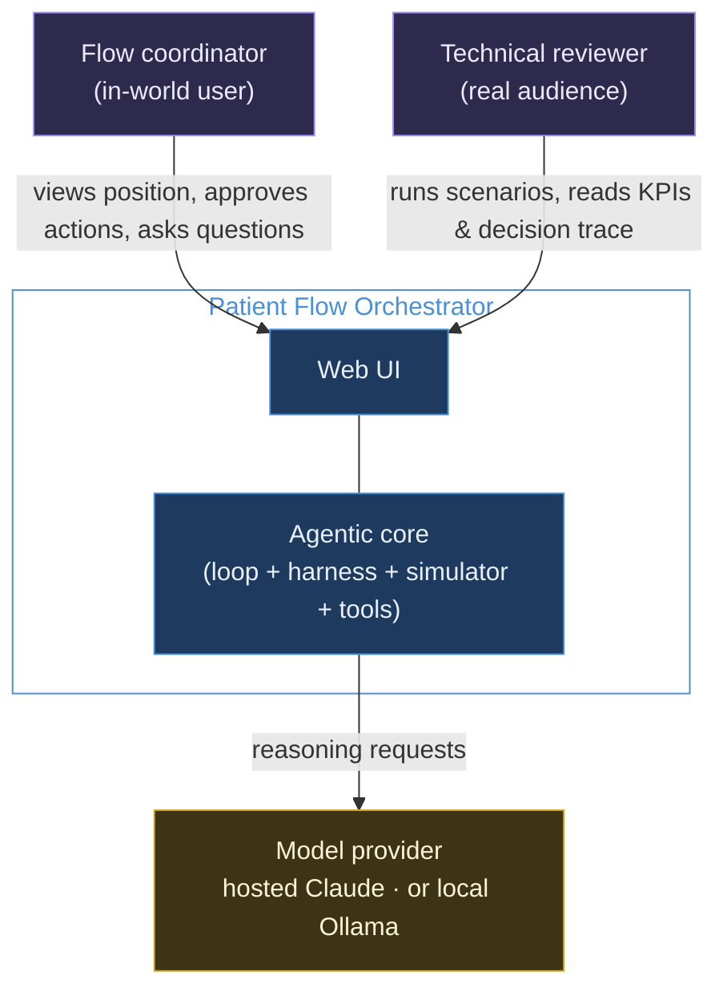
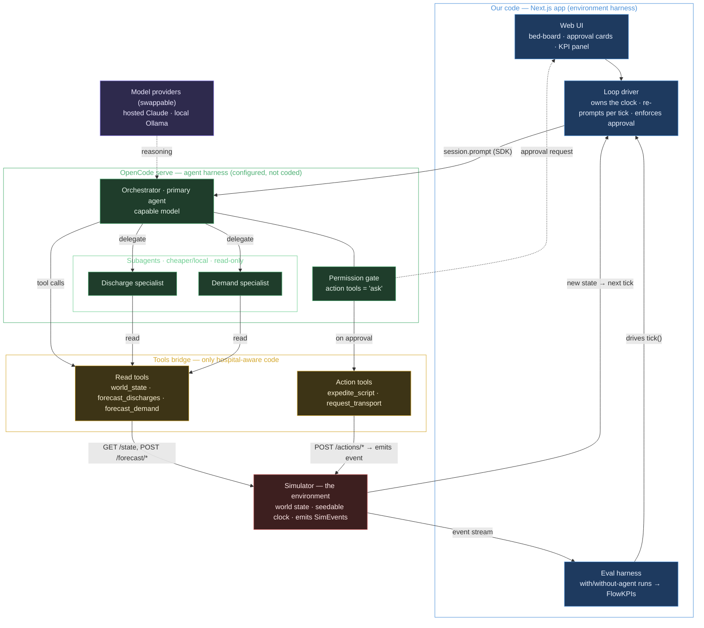
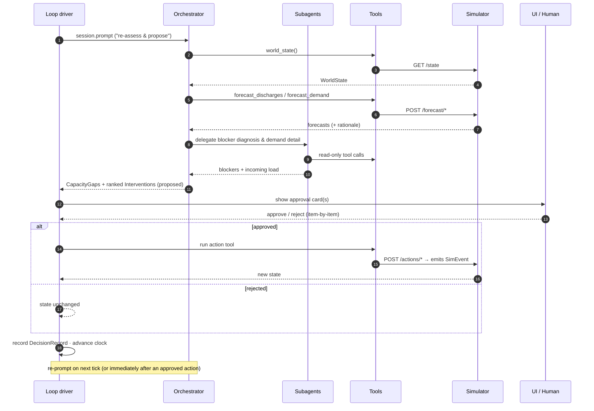
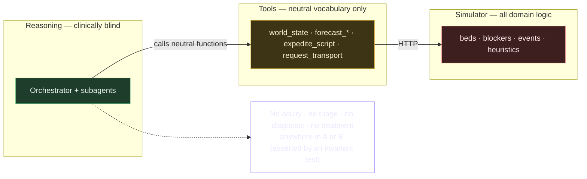
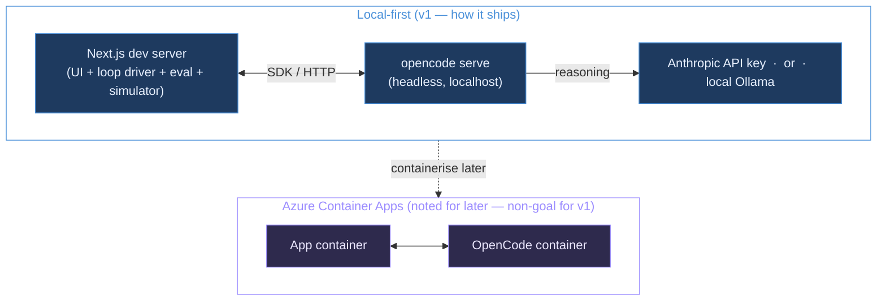

# Patient Flow Orchestrator — Architecture

| | |
| --- | --- |
| **Version** | 1.0.0 |
| **Status** | Draft |
| **Owner** | David |
| **Date** | 2026-06-11 |
| **Companions** | `PRD.md` (what & why), `OpenCode-Harness.md` (the agent runtime) |

> This is the **whole-solution architecture**: every component, how they connect, the data that flows
> between them, and the cross-cutting rules (safety, reproducibility, observability, portability) that
> shape the design. The PRD says what to build; this says how the pieces fit together.

---

## 1. At a glance

The Patient Flow Orchestrator is an **agent that runs a perceive → reason → plan → act loop over a simulated hospital.** A control loop in our app advances a simulated clock and, each tick, asks an AI agent (running inside the OpenCode harness) to assess the bed position, explain where capacity will fall short, and propose ranked fixes. A human approves each fix before it runs. Everything is synthetic, seedable, and carries zero clinical risk.

Five things make up the system:

1. **Simulator** — the synthetic hospital (state + events). *The environment.*
2. **Tools bridge** — typed functions the agent calls to read state and act. *The only hospital-aware code.*
3. **OpenCode harness** — the agent runtime (orchestrator + two subagents + permission gate).
4. **Loop driver** — our control loop; owns the clock, re-prompts each tick, enforces approval.
5. **Web UI** — bed-board, approval cards, KPI panel.

## 2. Principles that shape the design

- **The environment and the loop are ours; the reasoning is the harness's.** We never re-implement an agent loop; we never let the harness own the clock. (See `OpenCode-Harness.md`.)
- **Only the tools know it's a hospital.** The agent calls neutral functions (`world_state`, `expedite_script`). All domain — and therefore all regulation-relevant — logic lives in the simulator and tools. This is how the *no-clinical-output* rule is enforced in code, not in a prompt.
- **The model is a tool, not the brain of the forecast.** Discharge/demand forecasts are a transparent heuristic exposed as tools, so predictions are always inspectable.
- **Nothing changes state without a human.** Every state-changing action passes an approval gate enforced in our driver.
- **Determinism lives in the environment, not the model.** The simulator is seeded; the model is not. Reproducibility (and fair evaluation) comes from replaying the same event stream.
- **The reasoning provider is swappable.** Hosted Claude or a local model, with no change to tools, simulator, or UI.

## 3. System context (level 1)



The only external dependency is the **model provider**. There is deliberately **no hospital system, no database of real patients, no auth provider** — all out of scope, and all part of why the project is safe to publish.

## 4. Component architecture (level 2)



### 4.1 Simulator (the environment)

The only domain-aware *stateful* component. Holds the `WorldState`, advances a **seedable clock**, and emits typed `SimEvent`s — the only thing that mutates state. Exposes a small HTTP surface:

| Endpoint | Purpose |
| --- | --- |
| `GET /state` | current `WorldState` |
| `POST /forecast/discharges` | heuristic discharge forecast (with rationale) |
| `POST /forecast/demand` | heuristic demand forecast (with rationale) |
| `POST /actions/{type}` | apply an approved action → emits a `SimEvent` |

Because it's seeded, the same seed + scenario replays an identical event stream — the basis of reproducibility and fair evaluation.

### 4.2 Tools bridge

Typed TypeScript tools (`tool()` + Zod) registered with the harness. **Read tools** are side-effect-free; **action tools** POST to the simulator and are gated. The tools translate between the agent's neutral vocabulary and the simulator's HTTP API, and they are the boundary that keeps clinical logic out of the agent.

### 4.3 OpenCode harness

The agent runtime — one **primary** orchestrator plus two **read-only subagents** (discharge, demand) and the permission gate. Fully detailed in `OpenCode-Harness.md`; summarised in §4 above.

### 4.4 Loop driver

The outer control loop in the Next.js backend. Each tick it: sends one `session.prompt`, surfaces any proposed action to the UI, runs the approved action tool(s), then advances the clock. It is where the **real approval gate** lives (the harness `ask` is defence-in-depth — see `OpenCode-Harness.md` §7).

### 4.5 Web UI

Renders the **bed-board** (live position), the **approval cards** (the R7 surface), the **decision timeline** (audit trace), and the **KPI panel** (R11 evidence). Also hosts the free-text question box (R9).

### 4.6 Eval harness

Drives `tick()` headlessly across a seeded scenario, once **with** the agent's approved actions and once **without** any agent action, and computes the two `FlowKPIs` for each run.

## 5. Data model & contracts

The typed contracts every component honours (TypeScript/Zod-style; illustrative):

```ts
type ISOTime = string;
type BedStatus   = 'occupied' | 'empty_clean' | 'empty_dirty' | 'blocked';
type BlockerType = 'pharmacy_script' | 'transport' | 'allied_health' | 'placement' | 'none';

interface Ward    { id: string; name: string; bedCount: number; }
interface Bed     { id: string; wardId: string; status: BedStatus; patientId?: string; }
interface Patient {
  id: string; wardId: string; bedId: string; admittedAt: ISOTime;
  predictedDischarge?: { at: ISOTime; confidence: number; ready: boolean };
  blocker: BlockerType;
}
interface WorldState { at: ISOTime; wards: Ward[]; beds: Bed[]; patients: Patient[]; edQueue: string[] }

// The only thing that mutates WorldState
type SimEvent =
  | { kind: 'admission';        at: ISOTime; wardId: string; patientId: string }
  | { kind: 'discharge';        at: ISOTime; patientId: string }
  | { kind: 'blocker_resolved'; at: ISOTime; patientId: string; blocker: BlockerType }
  | { kind: 'bed_cleaned';      at: ISOTime; bedId: string }
  | { kind: 'ed_arrival';       at: ISOTime; patientId: string };

// Forecast tools — transparent heuristic; rationale is part of the contract
interface DischargeForecast {
  wardId: string; horizonHrs: number;
  predicted: { patientId: string; at: ISOTime; ready: boolean; blocker: BlockerType; rationale: string }[];
}
interface DemandForecast { wardId: string; horizonHrs: number; expectedAdmissions: number; rationale: string }

// Reasoning outputs
interface CapacityGap { wardId: string; atTime: ISOTime; projectedDeficit: number; factors: string[] }

type InterventionType   = 'expedite_script' | 'request_transport';  // v1; others deferred (PRD §10)
type InterventionStatus = 'proposed' | 'approved' | 'rejected' | 'executed';
interface Intervention {
  id: string; type: InterventionType;
  targetPatientId?: string; targetBedId?: string;
  addressesGap: string; impactScore: number; rationale: string;
  status: InterventionStatus;
}

// Audit + evaluation
interface DecisionRecord { at: ISOTime; type: 'gap'|'plan'|'action'; stateRef: string; rationale: string; payload: unknown }
interface FlowKPIs  { accessBlockHours: number; endOfDayHeadroom: number }
interface EvalResult { scenario: string; seed: number; withAgent: FlowKPIs; withoutAgent: FlowKPIs }
```

**Where each contract lives:** `WorldState`, `SimEvent`, forecasts → the **simulator** (over HTTP). `CapacityGap`, `Intervention` → reasoning **outputs** from the orchestrator. `DecisionRecord` → the **harness session history**, exported for the audit view. `FlowKPIs`/`EvalResult` → the **eval harness**.

## 6. Control flow — one planning tick



The closed loop is the return path: an approved action mutates the simulator, the driver advances the clock, and re-prompting on the new state is what makes the system *agentic over time* (PRD R8).

## 7. The safety boundary

The single most important architectural line: **the reasoning layer never sees clinical concepts.**



Because all domain logic sits behind the tools, an automated invariant test can assert that no system output (plan, answer, record) contains acuity, triage, diagnostic, or treatment content (PRD S13). Safety is a property of the architecture, not of prompt wording.

## 8. Cross-cutting concerns

| Concern | How the architecture delivers it |
| --- | --- |
| **Reproducibility** | The *simulator* is seeded; same seed + scenario → identical `SimEvent` stream. The model is not seeded, so the eval runs N trials and reports the distribution. |
| **Observability** | The harness session history is the decision trace; export it as `DecisionRecord`s and render a gaps → plans → approved-actions timeline. |
| **Provider portability** | Reasoning sits behind OpenCode's provider abstraction; switch hosted Claude ↔ local Ollama with no change to tools, simulator, or UI. |
| **Safety** | The tools boundary (§7) + invariant test. |
| **Latency** | One model round-trip per tick; subagents on cheaper/local models; coarse tick granularity for the demo (target a few seconds/cycle). |
| **Human control** | Approval gate enforced in the driver; action tools also marked `ask` as defence-in-depth. |

## 9. Deployment view



v1 ships **local-first**: `opencode serve` plus the Next.js dev server, with the simulator in-process. Containerising on Azure Container Apps is noted for later but is explicitly a non-goal for v1. "Rollback" is trivial — reset means reseed the simulator.

## 10. Technology stack

| Layer | Choice | Why |
| --- | --- | --- |
| Agent runtime | **OpenCode** (`opencode serve`) | Native primary/subagent model, permission gate, provider-swap, session audit — platform over bespoke framework. |
| Control loop / backend | **Next.js** + `@opencode-ai/sdk` | Drives one `session.prompt` per tick; keeps the clock and environment ours. |
| Frontend | **Next.js (App Router)** | Bed-board, approval cards, decision timeline, KPI panel. |
| Environment | **In-process `Simulator`** | Typed `SimEvent`s on a seedable clock; the only stateful domain component. |
| Forecast | **Transparent heuristic** as a tool | Inspectable rationale; keeps the agentic layer the showcase (no trained model in v1). |
| Tools | **TS `tool()` + Zod** in `.opencode/tools/` | Type-safe args; native to the permission system. |
| Models | **Anthropic API** or **local Ollama** via OpenCode | Satisfies provider portability. |
| Eval | **Headless sim runs** → `FlowKPIs` | Evidence, deterministic on a fixed seed. |

## 11. Key risks (architecture-relevant)

- **SDK permission bypass** — `ask`/`deny` may be ignored for SDK-driven sessions, so the real gate is in the driver (see `OpenCode-Harness.md` §7).
- **Agent non-determinism** — handled by seeding the environment, not the model, and reporting distributions.
- **API drift** — pin OpenCode; isolate SDK calls behind one adapter module.
- **Per-tick latency** — cheaper/local subagent models; coarse tick granularity.
- **Scope creep into clinical logic** — prevented by the tools boundary + invariant test.

---

## Changelog

| Version | Date | Note |
| --- | --- | --- |
| 1.0.0 | 2026-06-11 | Initial whole-solution architecture: principles, system-context (L1) and component (L2) diagrams, component breakdown, data contracts, control-flow sequence, safety-boundary diagram, cross-cutting concerns, deployment view, stack, risks. |
