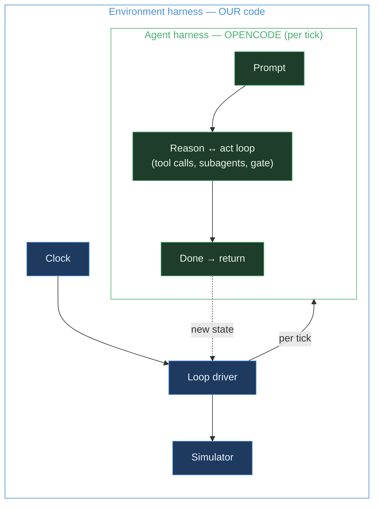

# The OpenCode Harness — Technical Companion

| | |
| --- | --- |
| **Version** | 1.1.0 |
| **Status** | Draft |
| **Owner** | David |
| **Date** | 2026-06-11 |
| **Companion to** | `PRD.md` (§7) |

> This document explains the **harness** layer of the Patient Flow Orchestrator in detail — what OpenCode
> provides, how we configure it, and where our own code takes over. The PRD says *what* the system does;
> this says *how the agent runtime is wired.* Plain language, but more technical than the PRD.

---

## 1. What a "harness" is, and why OpenCode

A language model on its own just produces text. To make it an **agent**, you need a layer around it that:

- builds the prompt and sends it to the model,
- lets the model **call tools** and feeds the results back,
- **loops** until the model is done,
- lets it **delegate** sub-tasks to other agents,
- decides which actions need a **human's permission**, and
- **records** everything it did.

That layer is the **harness**. Writing one from scratch is most of the work in an agent project. **OpenCode is a ready-made harness** — it was built as a coding agent, but its primitives (agents, tools, permissions, sessions, provider abstraction) are general. We use it as the runtime and write only the parts that are genuinely ours.

The trade-off, stated plainly: we're using a *coding-agent* runtime for a *non-coding* job, and OpenCode ships fast so its APIs can drift (see §9). We accept both because the alternative — hand-building the loop, the gate, the provider-swap, and the audit trail — is far more code and far more risk.

## 2. Two nested harnesses

The system is **two harnesses, one inside the other.**



- **Outer (ours):** a thin control loop owns the simulated clock. Each tick it sends **one prompt** to OpenCode and renders the result. This is what makes the system agentic *over time*.
- **Inner (OpenCode):** within that one prompt, the harness runs the **reason-and-act loop** — model → tool calls → results → loop → done. We configure this; we don't write it.

OpenCode does not run as a long-lived loop on its own, which is exactly why the outer loop is ours.

## 3. Running it: `opencode serve`

We run OpenCode **headless** as a local server:

```bash
opencode serve            # exposes the OpenCode HTTP API on a local port
```

Our Next.js backend talks to it through the official SDK (`@opencode-ai/sdk`). Nothing about the harness is embedded in our process — it's a separate service we drive over the API.

## 4. File layout

Everything the harness needs lives in an `.opencode/` directory in the repo:

```
.opencode/
  agents/
    orchestrator.md        # primary agent (config + system prompt)
    discharge.md           # subagent
    demand.md              # subagent
  tools/
    world_state.ts         # read tool
    forecast_discharges.ts # read tool
    forecast_demand.ts     # read tool
    expedite_script.ts     # action tool (gated)
    request_transport.ts   # action tool (gated)
opencode.json              # global config: default provider/model, etc.
```

Agents are **Markdown files** (YAML front-matter for config, body for the system prompt). Tools are **TypeScript files**. This is the whole "configured, not coded" surface.

## 5. The agents

OpenCode has two agent **types**: a **primary** agent (the one you prompt directly) and **subagents** (specialists the primary delegates to via the Task tool, or that you `@mention`). The `mode` field selects the type — `primary`, `subagent`, or `all`. If a primary agent doesn't name a model, it uses the global default; **a subagent with no model inherits the model of the primary that called it** — so the per-agent `model` field is the seam for running subagents on a different (cheaper/local) model.

> **As shipped (v1.5):** all three agents run on the **OpenCode Zen free-tier `opencode/big-pickle`** (the swappable default in `PRD §10`). The per-agent split below is for *context isolation and least privilege*, not for a model-cost difference — the `model:` field is set the same on each, and the cheaper-subagent option remains available but unused in the demo. The frontmatter snippets below show the *shape*; the live values (`opencode/big-pickle`, an explicit built-in deny-list) are noted inline.

### 5.1 Orchestrator — primary agent

```md
# .opencode/agents/orchestrator.md
---
description: Patient-flow orchestrator — perceive, reason, plan, act
mode: primary
model: opencode/big-pickle      # swappable: anthropic/* or a local Ollama model
permission:
  world_state: allow
  forecast_discharges: allow
  forecast_demand: allow
  expedite_script: ask          # state-changing → human approval
  request_transport: ask
---
Each cycle: perceive via world_state → call the forecast tools → detect and explain
capacity gaps → delegate blocker diagnosis to @discharge and incoming load to @demand →
rank interventions by impact → propose actions (these require approval).
Never assign acuity, triage, diagnosis, or treatment.
```

The orchestrator is the only agent that can reach the **action tools**, and those are marked `ask` so they pause for a human (§7).

### 5.2 Discharge specialist — subagent (read-only)

```md
# .opencode/agents/discharge.md
---
description: For each not-ready discharge, name the specific blocker and a short reason
mode: subagent
model: opencode/big-pickle      # the model field is the cheaper/local-swap seam
permission:
  world_state: allow
  forecast_discharges: allow
  # Built-ins are denied EXPLICITLY (bash/read/write/edit/grep/glob/list/webfetch),
  # not via a "*": deny wildcard — in this OpenCode version the wildcard also
  # suppressed the allowed custom domain tools (fixed in PR #25).
---
Given the current world state, for each predicted-but-not-ready discharge,
return the specific blocker (pharmacy_script | transport | allied_health | placement)
with a one-line reason. Do not propose actions.
```

### 5.3 Demand specialist — subagent (read-only)

```md
# .opencode/agents/demand.md
---
description: Forecast incoming ED / admission load over the horizon
mode: subagent
model: opencode/big-pickle
permission:
  world_state: allow
  forecast_demand: allow
  # Built-ins denied explicitly (see the discharge subagent above), not via "*": deny.
---
Estimate expected admissions per ward over the given horizon, each with a short reason.
Do not propose actions.
```

**Why split into subagents.** Each runs in its own isolated context, so the orchestrator's working memory stays focused on planning. Each has a narrow, testable job. And because the subagents are **read-only**, the action capability exists in exactly one agent — the orchestrator — behind the approval gate. (The split *could* also put the cheaper work on a cheaper model — the `model:` seam is there — but the shipped demo runs them all on `opencode/big-pickle`.)

## 6. The tools (the bridge)

Tools are plain TypeScript using `tool()` from `@opencode-ai/plugin`; argument types are declared with `tool.schema` (which is Zod). The harness handles calling them and feeding results back to the model. **The tools are the only code that knows it's a hospital** — they call the simulator over HTTP.

```ts
// .opencode/tools/world_state.ts — perception (read-only)
import { tool } from "@opencode-ai/plugin"
export default tool({
  description: "Return the current hospital world state",
  args: {},
  async execute() {
    const r = await fetch(`${process.env.SIM_URL}/state`)
    return await r.text()                       // WorldState as JSON
  },
})
```

```ts
// .opencode/tools/forecast_discharges.ts — transparent heuristic forecast
import { tool } from "@opencode-ai/plugin"
export default tool({
  description: "Heuristic discharge-readiness forecast with inspectable rationale",
  args: {
    wardId:     tool.schema.string(),
    horizonHrs: tool.schema.number().describe("forecast horizon in hours"),
  },
  async execute(a) {
    const r = await fetch(`${process.env.SIM_URL}/forecast/discharges`, {
      method: "POST", body: JSON.stringify(a),
    })
    return await r.text()                       // each prediction carries a rationale
  },
})
```

```ts
// .opencode/tools/expedite_script.ts — state-changing ACTION (gated)
import { tool } from "@opencode-ai/plugin"
export default tool({
  description: "Expedite a pending pharmacy script to unblock a discharge",
  args: { patientId: tool.schema.string() },
  async execute(a) {
    const r = await fetch(`${process.env.SIM_URL}/actions/expedite_script`, {
      method: "POST", body: JSON.stringify(a),
    })
    return await r.text()                       // emits a SimEvent back into the environment
  },
})
```

Read tools hit `/state` and `/forecast/*`; action tools `POST` to `/actions/*` and the simulator emits an event that mutates world state.

## 7. The permission gate (the human approval step)

OpenCode's permission system decides, per tool, whether a call runs automatically (`allow`), is blocked (`deny`), or **pauses for approval (`ask`)**. In an agent's config, `true` means `{"*": "allow"}` and `false` means `{"*": "deny"}`; per-agent rules merge with the global config and take precedence. We mark the action tools `ask`, which is requirement **R7** satisfied by configuration rather than custom code.

**An important real-world caveat.** There is a known issue that **permissions can be bypassed when an agent is invoked through the SDK** — `deny`/`ask` rules set in config may be ignored for SDK-driven sessions (see §9 sources). Because we drive OpenCode from our Next.js backend over the SDK, we **do not rely on the harness to block the action for us.** Instead:

> **We gate in our own loop driver.** A proposed action is surfaced to the UI as an approval card; the driver only lets the corresponding action tool run **after a human clicks approve.** The `ask` config stays as defence-in-depth, but the real gate is ours.

This is the decision recorded in PRD §10. It keeps the safety guarantee in code we control, not in a harness behaviour that may change.

## 8. The SDK driver (the outer loop)

The control loop lives in the Next.js backend and uses `@opencode-ai/sdk`. One `session.prompt` per simulated tick:

```ts
import { createOpencodeClient } from "@opencode-ai/sdk"

const client  = createOpencodeClient({ baseUrl: process.env.OPENCODE_URL! })
const session = await client.session.create({ body: { title: "flow" } })

export async function tick() {                  // called once per simulated clock step
  await client.session.prompt({
    path: { id: session.id },
    body: { parts: [{ type: "text", text: "Re-assess the position and propose interventions." }] },
  })
  // approved action tools have mutated the sim; advance the clock; the UI shows the new position
}
```

The same `tick()` drives the evaluation harness: run it across a seeded scenario, then run the scenario again with no agent, and compare the two flow KPIs (PRD R11).

**Adapter discipline.** All SDK calls sit behind one thin adapter module. If OpenCode's API drifts, only that module changes — see §9.

## 9. Known limitations & version pinning

- **SDK permission bypass.** As above (§7) — `ask`/`deny` may not be enforced for SDK-invoked sessions, so approval is enforced in our driver, not the harness.
- **Fast-moving APIs.** OpenCode ships frequently and agent/SDK APIs can change between releases. Mitigation: **pin the OpenCode version** and isolate every SDK call behind the adapter module.
- **Non-determinism.** The model's reasoning isn't perfectly reproducible. We seed the *simulator* (not the model) and report distributions across N trials, so the evaluation stays fair (PRD §9 risks).
- **Coding-agent fit.** OpenCode is built for coding; we're using its general primitives for a non-coding domain. Works well, but some defaults assume a code workspace.

## 10. Harness vs. our code — the line

| The OpenCode harness gives us | We build |
| --- | --- |
| Per-tick reason-and-act loop | The per-tick **outer loop** (clock + re-prompt) |
| Tool execution + Zod schemas | The **tools** (the hospital bridge) |
| Subagent delegation (primary → subagents) | The **simulator** (the environment) |
| Permission system (`allow`/`ask`/`deny`) | The **real approval gate** in the driver (§7) |
| Provider swap (hosted Claude ↔ local Ollama) | The **UI** (bed-board, approval cards, KPI panel) |
| Session history (the audit trail) | The **eval harness** (with/without-agent KPIs) |

---

## Sources

- [Agents — OpenCode](https://opencode.ai/docs/agents/)
- [Config — OpenCode](https://opencode.ai/docs/config/)
- [Permissions — OpenCode](https://opencode.ai/docs/permissions/)
- [Custom Tools — OpenCode](https://opencode.ai/docs/custom-tools/)
- [Tools — OpenCode](https://opencode.ai/docs/tools/)
- [Plugins — OpenCode](https://opencode.ai/docs/plugins/)
- [Issue #6396 — custom agent 'deny' permissions ignored when invoked via SDK](https://github.com/anomalyco/opencode/issues/6396)
- [Issue #5965 — SDK-level permission overrides for tools (feature request)](https://github.com/sst/opencode/issues/5965)

## Changelog

| Version | Date | Note |
| --- | --- | --- |
| 1.0.0 | 2026-06-11 | Initial harness companion: harness concept, two-loop model, `opencode serve`, file layout, agent configs (1 primary + 2 read-only subagents), custom tools, permission gate + SDK-bypass caveat, SDK driver, limitations, harness-vs-our-code line. |
| 1.1.0 | 2026-06-29 | §5 reconciled with the shipped harness (#55): all three agents run `opencode/big-pickle` (not Sonnet/Ollama) — the per-agent `model:` seam is for context isolation/least privilege, the cheaper-subagent split is available but unused in the demo; built-ins are denied **explicitly** (not via a `"*": deny` wildcard, which suppressed the custom domain tools — PR #25). |
