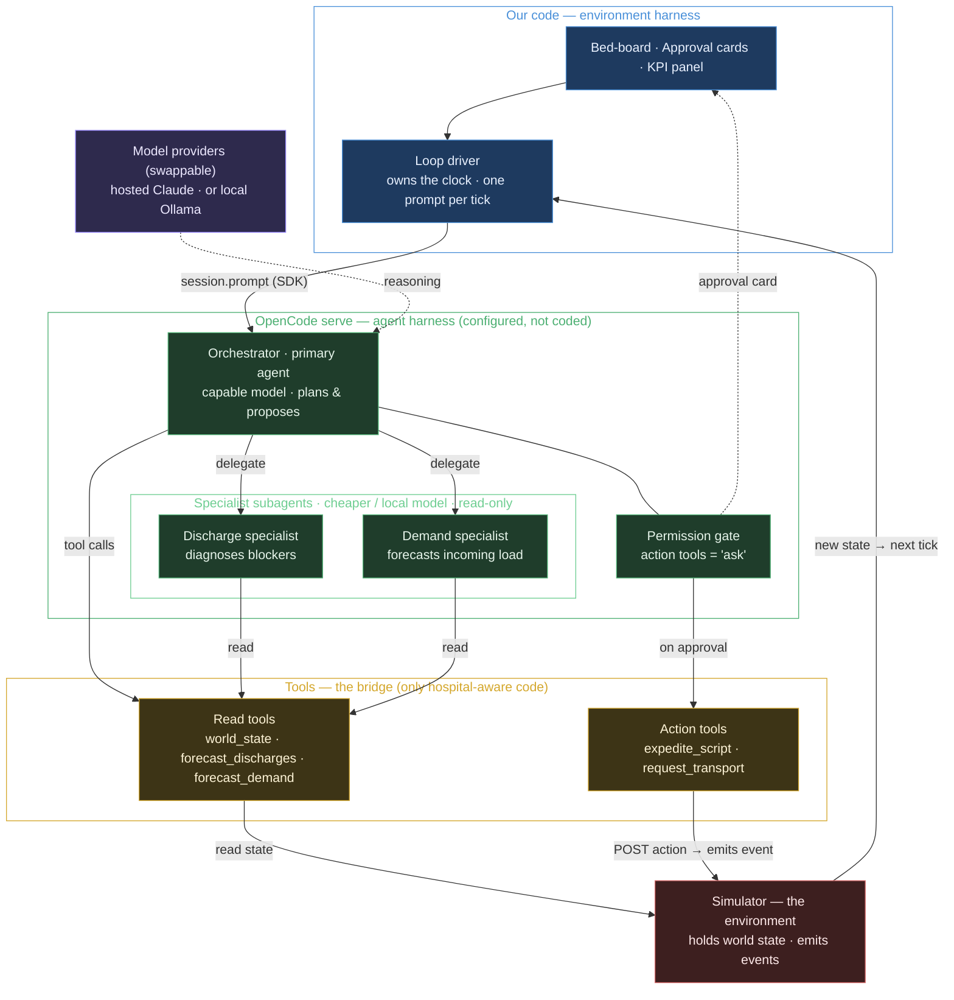
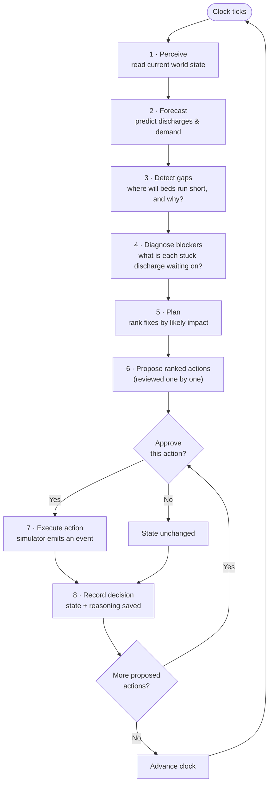

# Patient Flow Orchestrator — Product Requirements Document

| | |
| --- | --- |
| **Version** | 1.4.0 |
| **Status** | Approved |
| **Owner** | Daniel David |
| **Date** | 2026-06-12 |

---

## 1. What this is

A hospital bed coordinator spends the day doing two hard things: working out where the hospital will run out of beds in a few hours, and getting on the phone to fix it — chasing pharmacy, transport, allied health, and cleaning to free up beds in time.

Today's software is a bed-board. It *shows* the current state but it can't *think* about it. It won't tell you that Ward 4B will be two beds short by 4pm, explain why three discharges are stuck, or line up the actions that fix the gap. All of that lives in the coordinator's head and on the phone.

This project adds a thinking-and-doing layer on top of that work. It is an **AI agent** that watches a simulated hospital, predicts where capacity will fall short, explains why, and proposes a ranked list of fixes — which a human approves before anything happens.

## 2. Who it's for

There are two audiences:

- **The in-world user** — a flow coordinator who wants the projected bed position, the blockers behind it, and a short list of actions they can approve.
- **The real audience** — technical reviewers judging the **design of the agent**. The hospital workflow was chosen on purpose: it's a rich, moving problem (changing state, multi-step planning, tool use, a human approval step, a measurable result), but it carries **zero clinical risk** and is easy to understand. So the agent design is what's on show, not medical complexity.

The system is a **portfolio piece**. It runs entirely on **made-up (synthetic) data** and never makes a clinical judgement — no diagnosis, no treatment, no patient prioritisation. That also keeps it well clear of any medical-device regulation.

## 3. Goals

- Show a real **perceive → reason → plan → act loop** running over a *changing* environment — the thing that makes this an agent and not just a forecast dashboard.
- Show **multiple agents working together** (one orchestrator directing specialist helpers) and treat the forecast as a **tool the agent calls**, not the agent itself.
- Keep a **human approval step** on every action that changes something. The agent proposes; a person says yes or no; only then does it act.
- Produce **hard evidence**, not just a demo — run the same day with and without the agent and show the difference in a simple metrics panel.
- Stay **safe and repeatable**: synthetic data only, and the same starting seed always produces the same day.

## 4. Out of scope (for now)

- **No real hospital system integration.** Any record access is faked behind a tool.
- **No real patient data.** Synthetic only, so the project is safe to publish.
- **No clinical decisions** of any kind, anywhere in the system.
- **No trained AI forecaster yet.** Predictions use a simple, transparent rule set so you can always see *why* a prediction was made.
- **No fully automatic actions.** Nothing that changes state runs without a human approving it.
- **No production deployment, multiple hospitals, or logins.** One simulated hospital.

## 5. What it must do

| # | Requirement (plain language) |
| --- | --- |
| R1 | Simulate a hospital over time — admissions, discharges, beds being cleaned, ED arrivals, blockers clearing — on a clock you can control. |
| R2 | Keep a live picture of the hospital: wards, beds and their status, patients and their predicted discharge, and the ED queue. |
| R3 | Offer **discharge** and **demand** forecasts as tools the agent can call, each with a plain-English reason for the prediction. |
| R4 | Spot where a ward will be **short of beds** over the next few hours and explain *why* (e.g. fewer discharges than admissions). |
| R5 | For every discharge that's predicted but not ready, name the **specific blocker** (pharmacy script, transport, allied-health sign-off, placement). The agent diagnoses *all four* blocker types. |
| R6 | Produce a **ranked list of fixes**, each one tied to the gap or blocker it addresses, ordered by likely impact. In v1 the agent can *act on* two blocker types (pharmacy and transport — see §10); a blocker with no v1 action is still surfaced, just without a one-click fix. |
| R7 | Require **human approval before any action that changes state.** Each proposed action is approved or rejected **item-by-item**; approved actions run, rejected ones don't. |
| R8 | **Re-think and re-plan** whenever things change — after an approved action, or after the clock moves — and show the updated position. |
| R9 | Answer **plain-language questions** ("what's tonight looking like?", "why is 4B blocked?") using the live picture. |
| R10 | Keep an **audit trail** — every gap, plan and action saved with the state and reasoning behind it. |
| R11 | Run a scenario **with and without the agent** and compare the results on two metrics (defined below), shown together in a KPI panel. |

**The two metrics (R11):**

- **Access-block hours** — total time patients wait for a bed that isn't available (the ED arrival or ward-transfer is ready, but there's no clean, empty bed yet). Lower is better.
- **End-of-day headroom** — the number of clean, empty beds left at the end of the simulated day. Higher is better.

## 6. How well it must do it

- **Safe.** Synthetic data only, no patient information, and no clinical output — checked by an automatic test, not just a promise.
- **Repeatable.** The simulation is *seedable*: the same seed and scenario always produce the exact same day, so comparisons are fair.
- **Portable.** The reasoning model is swappable (hosted Claude or a local model) without touching the rest of the system.
- **Inspectable.** Every decision is logged with its inputs and reasoning, ready for a timeline view.
- **Fast enough.** A planning cycle should finish in a few seconds so a live demo feels responsive.
- **Demo-friendly.** The day can be stepped, played, sped up, and loaded from named scenarios.

## 7. The solution

The key choice: **don't build an agent framework from scratch — use OpenCode as the AI harness.** A "harness" is everything that wraps a language model and turns it into a working agent: the reason-and-act loop, the tools it can call, the way it delegates to helpers, the permission checks, and the record of what it did. Building that from scratch is most of the work in any agent project. OpenCode already provides it, so we configure a harness instead of coding one.

### 7.1 An AI-harness approach (two nested loops)

The system is really **two harnesses, one inside the other.**

- **The environment harness — ours.** A thin control loop in the Next.js backend owns the simulated clock. Each tick it advances the world and sends one prompt to the agent through the OpenCode SDK, then renders the new position. OpenCode doesn't run as a long-lived process, so this *outer* loop — the thing that makes the system agentic *over time* — is genuinely our code.
- **The agent harness — OpenCode.** Inside a single tick, `opencode serve` (running headless) does the *inner* reason-and-act loop: it sends the prompt to the model, runs any tool calls the model asks for, loops until the model is finished, delegates focused work to subagents, enforces the permission gate, and saves the whole session. We configure this layer; we don't write it.

So the division is clean: **we own the world and the clock; the harness owns the reasoning within each tick.**

| The harness (OpenCode) gives us | We build |
| --- | --- |
| The per-tick reason-and-act loop | The per-tick **outer loop** (clock + re-prompt) |
| Tool execution and schemas | The **tools** themselves (the hospital bridge) |
| Subagent delegation | The **simulator** (the environment) |
| The permission gate (the human approval step) | The **UI** (bed-board, approval cards, KPI panel) |
| Provider swap (hosted Claude ↔ local model) | — |
| Session history (the audit trail) | — |

### 7.2 The agents

Three agents run inside the harness, each a different *type* with its own job, model, and tool access. Splitting the work this way keeps each agent's context small and its prompt focused, and lets the cheaper work run on a cheaper model.

| Agent | Type | Model | Tools it can use | Job |
| --- | --- | --- | --- | --- |
| **Orchestrator** | Primary agent (the one we prompt each tick) | Capable model (e.g. hosted Claude Sonnet) | All read tools **+** the action tools (action tools gated as `ask`) | Perceive the state, detect and explain capacity gaps, delegate the detail work, rank the fixes, propose actions for approval, and answer plain-language questions. |
| **Discharge specialist** | Subagent (called by the orchestrator) | Cheaper / local model | Read-only: `world_state`, `forecast_discharges` | For each predicted-but-not-ready discharge, work out the **specific blocker** and a short reason. Reports back; never proposes actions. |
| **Demand specialist** | Subagent (called by the orchestrator) | Cheaper / local model | Read-only: `world_state`, `forecast_demand` | Estimate the **incoming load** (ED arrivals / projected admissions) over the horizon, with a reason. Reports back. |

**Why two subagents and not one big prompt.** Each subagent runs in its own isolated context, so the orchestrator's working memory stays clean and focused on planning. Each has a narrow, well-tested job, so it's easier to reason about and cheaper to run. And because subagents are **read-only**, only the orchestrator can ever reach an action tool — which is itself gated by the human approval step. The risky capability lives in exactly one place.

### 7.3 Ownership zones

The colours in the diagram below mark three zones:

- **Our code (blue)** — the Next.js app and the simulator.
- **Configured, not coded (green)** — the OpenCode harness and its three agents.
- **The bridge (amber)** — the tools, the *only* part of the system that knows it's a hospital. Because every agent only ever calls neutral tools like `world_state` or `expedite_script`, the reasoning layer never touches clinical logic — which is how the no-clinical-output rule is enforced in code, not just asked for in a prompt.

### 7.4 Architecture

### 7.5 Workflow — one planning cycle

*The cycle also re-runs immediately after an approved action takes effect, not only when the clock advances (R8) — shown here as a single loop for simplicity.*

## 8. Key decisions

- **OpenCode as the runtime, not a custom framework** — far less code; the approval gate, model-swap, and audit trail come for free. Trade-off: the loop runs outside the agent, and we're using a coding-agent runtime for a non-coding job.
- **The control loop lives in our app** and re-prompts once per tick, so the clock and the hospital stay ours; the agent only reasons within a tick.
- **The forecast is a transparent rule set, not a model** — you can always see why it predicted what it did, and the agent stays the star of the show.
- **The human gate is just configuration** — action tools are marked `ask`, surfaced to the UI as an approval card.
- **Only the tools know it's a hospital** — all domain (and regulation-relevant) logic stays out of the agent, which is how safety is enforced rather than hoped for.

## 9. Risks

| Risk | Mitigation |
| --- | --- |
| Agent randomness undermines the repeatable evaluation. | Seed the *simulator*; run several trials per scenario and report the spread, not one exact replay. |
| The approval step may not surface cleanly to a custom UI. | Resolved (§10): gate approval in our own loop driver — the action tool only runs after the human approves in the UI. |
| An AI round-trip per cycle is slow. | Use cheaper/local models for subagents; use a coarser clock for the demo. |
| OpenCode's APIs change fast. | Pin the version; keep all SDK calls behind one thin adapter. |
| Scope creeps into clinical logic. | An automatic safety test asserts no clinical output; tools never expose anything clinical. |

## 10. Resolved decisions

Guiding principle: **keep it as simple as possible.** This is a portfolio project showing how to use AI in a semi-real (made-up) hospital. Every choice below picks the smallest thing that still demonstrates the idea.

| Question | Decision |
| --- | --- |
| **Ward layout & bed counts** | One **ED** as the source of demand, plus **two inpatient wards of 10 beds each**. Small enough to read at a glance, big enough to create a real bottleneck. |
| **Which actions ship first** | Just **two**: `expedite_script` (pharmacy) and `request_transport`. They cover the two most common blockers and prove the approve-then-act loop. The rest (page allied health, early clean, ward transfer, escalate) are listed but not built in v1. |
| **Evaluation scenarios** | **Two**: a *normal weekday* baseline and one *flu surge* (more ED arrivals). Enough to show with-vs-without-agent impact without a scenario zoo. |
| **Default demo model** | **OpenCode Zen free tier** (`opencode/big-pickle`) — zero API key, zero cost, zero local server, so anyone can clone and run the demo. The provider stays swappable, so hosted Claude and local Ollama remain options. |
| **Approval step in headless mode** | Keep it simple: **gate in our own loop driver.** The UI shows the approval card and the driver only runs the action tool after a human clicks approve — no dependence on OpenCode's internal permission events. |

---

## Success criteria (how we know it works)

| # | We can show that… |
| --- | --- |
| S1 | A seeded day produces events in order, and the live picture matches them. |
| S2 | Each forecast comes with a human-readable reason. |
| S3 | When discharges fall short of admissions, the agent reports a gap *with an explanation*. |
| S4 | Each not-ready discharge gets a specific blocker and reason. |
| S5 | The plan is a ranked list, each item tied to the gap it fixes. |
| S6 | Reject an action → nothing changes. Approve it → exactly one event happens. |
| S7 | After a change, the new position differs in a way traceable to that change. |
| S8 | Plain-language questions get answers consistent with the live picture. |
| S9 | Every gap, plan and action has a saved decision record. |
| S10 | The evaluation outputs both metrics for with- and without-agent runs in a KPI panel. |
| S11 | **The agent helps:** in both scenarios the with-agent run shows *fewer access-block hours* and *more end-of-day headroom* than the without-agent run. |
| S12 | The same seed run twice produces identical results. |
| S13 | No system output ever contains clinical content (asserted by a test). |

---

## Changelog

| Version | Date | Note |
| --- | --- | --- |
| 1.0.0 | 2026-06-11 | Consolidated PRD from spec + plan; plain language; architecture and workflow diagrams. |
| 1.1.0 | 2026-06-11 | Resolved the five open questions (§10); status → Approved. |
| 1.2.0 | 2026-06-11 | Review fixes: clarified detect-all/act-on-two scope (R5–R6); defined the two KPIs; added item-by-item approval to the workflow; added "agent helps" success criterion (S11); removed stray Action subagent; added this changelog. |
| 1.3.0 | 2026-06-11 | Expanded §7: AI-harness framing (two nested loops), agent roster (orchestrator + two read-only subagents) with model/tool/permission detail, harness-vs-our-code table, and an enriched architecture diagram showing agent types and swappable model providers. |
| 1.4.0 | 2026-06-12 | §10: changed the default demo model from hosted Claude to the OpenCode Zen free tier (`opencode/big-pickle`) — zero-key, zero-cost demo; Claude and Ollama remain swappable. Verified end-to-end against the Phase 3 harness. |
